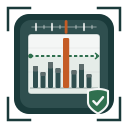
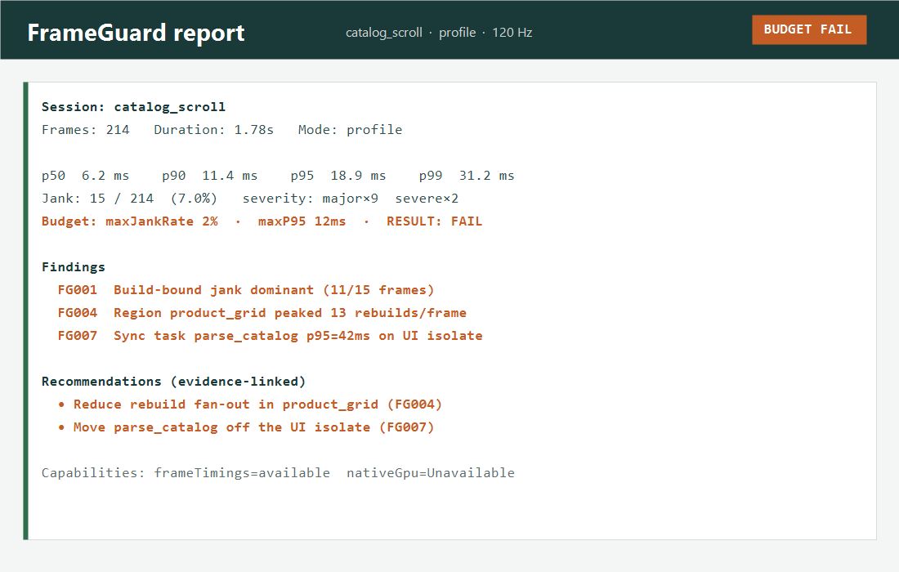

<p align="center">
  
</p>

<h1 align="center">FrameGuard</h1>

<p align="center">
  <strong>Performance regressions, testable.</strong><br/>
  Automated Flutter UI performance regression detection — budgets, baselines, and evidence-backed reports you can enforce in CI.
</p>

<p align="center">
  <a href="https://pub.dev/packages/frameguard"></a>
  <a href="https://pub.dev/packages/frameguard/score"></a>
  <a href="https://pub.dev/packages/frameguard"></a>
  <a href="https://github.com/theworker02/frameguard/actions/workflows/ci.yml"></a>
  <a href="https://github.com/theworker02/frameguard/actions/workflows/pages.yml"></a>
  <a href="LICENSE"></a>
</p>

<p align="center">
  <a href="https://github.com/theworker02/frameguard/stargazers"></a>
  <a href="https://github.com/theworker02/frameguard/issues"></a>
  <a href="https://github.com/theworker02/frameguard/pulls"></a>
  <a href="https://github.com/theworker02/frameguard"></a>
  <a href="https://dart.dev"></a>
  <a href="https://theworker02.github.io/frameguard/"></a>
  <a href="https://thanks.dev/u/gh/theworker02"></a>
  <a href="https://github.com/sponsors/theworker02"></a>
</p>

<p align="center">
  <a href="https://theworker02.github.io/frameguard/">Docs</a> ·
  <a href="https://pub.dev/packages/frameguard">pub.dev</a> ·
  <a href="doc/cli.md">CLI</a> ·
  <a href="CHANGELOG.md">Changelog</a> ·
  <a href="https://thanks.dev/u/gh/theworker02">Sponsor</a>
</p>

<p align="center">
  
</p>

---

## Status

| | |
|--|--|
| **Version** | `0.6.0` |
| **Repository** | [github.com/theworker02/frameguard](https://github.com/theworker02/frameguard) |
| **Package** | [pub.dev/packages/frameguard](https://pub.dev/packages/frameguard) |
| **Docs site** | [theworker02.github.io/frameguard](https://theworker02.github.io/frameguard/) |
| **License** | MIT |
| **Telemetry** | None — local by default |

---

## Why FrameGuard?

Flutter already has excellent profilers. **DevTools** answers:

> What happened during this profiling session?

**FrameGuard** answers:

> Did performance regress, where, why is that likely, and should this build fail?

| | DevTools | FrameGuard |
|---|----------|------------|
| Goal | Interactive exploration | Automation & regression gates |
| Output | Timelines you interpret | Budgets, baselines, matchers, CI exit codes |
| Audience | Humans in a profiling session | Humans *and* pipelines |
| Telemetry | N/A | **None** — local by default |

FrameGuard is **not** a thin DevTools wrapper. It turns documented Flutter frame timings into reproducible explanations.

---

## Features

- **Session capture** via `SchedulerBinding.addTimingsCallback` / `FrameTiming`
- **Refresh-rate-aware budgets** (60 / 90 / 120 / 144 Hz — no hardcoded 16.67 ms dogma)
- **Jank severity** (healthy / minor / major / severe)
- **Percentiles** — p50 / p90 / p95 / p99, histograms, streaks
- **Build vs raster** classification (derived, never claimed as certainty)
- **Regions & rebuild counts** (`FrameGuardRegion`)
- **Traces, markers, sync tasks**
- **Explainability + recommendations** tied to evidence (`FG001`–`FG010`)
- **JSON / text / HTML** reports (versioned schema)
- **CSV · JUnit · SARIF · Markdown** exporters for CI / PR comments
- **Baselines & golden files** (never silently overwritten)
- **Multi-run statistics** (median, MAD, CI; outliers flagged, not deleted)
- **Test matchers** + `FrameGuardTest.measure`
- **CLI** for compare / check / export / summary / doctor / baseline / history / suggest-budget
- **Local history** (JSONL) for gradual drift without a backend
- **Reusable GitHub Action** (`.github/actions/frameguard-check`)
- **Optional overlay** & runtime budget watcher
- **Capability model** — Unavailable beats fake zeros

---

## Install

```yaml
# pubspec.yaml
dependencies:
  frameguard: ^0.6.0
```

For tests-only usage you can keep it under `dev_dependencies`. Test helpers live in a separate library:

```dart
import 'package:frameguard/frameguard.dart';
import 'package:frameguard/frameguard_test.dart';
```

```bash
flutter pub get
```

---

## Quick start

```dart
import 'package:flutter/material.dart';
import 'package:frameguard/frameguard.dart';

void main() {
  FrameGuard.initialize(
    config: FrameGuardConfig(
      samplingMode: SamplingMode.balanced,
      defaultBudget: FrameBudget.forRefreshRate(60, maxJankRate: 0.02),
    ),
  );

  runApp(
    const FrameGuardScope(
      child: FrameGuardOverlay(
        compact: true,
        child: MyApp(),
      ),
    ),
  );
}
```

### Capture a session

```dart
final session = FrameGuard.startSession(name: 'home_scroll');
// …interact with the app…
final report = await session.stop();

debugPrint(report.summary());
await report.writeJson(File('reports/home_scroll.json'));
await report.writeHtml(File('reports/home_scroll.html'));
```

### Assert in tests

```dart
testWidgets('product list stays within budget', (tester) async {
  await tester.pumpWidget(const App());

  final report = await FrameGuardTest.measure(
    tester,
    name: 'product_list',
    action: () async {
      await tester.fling(find.byType(ListView), const Offset(0, -1000), 1000);
      await tester.pumpAndSettle();
    },
  );

  expect(
    report,
    meetsFrameBudget(
      FrameBudget.forRefreshRate(
        60,
        maxJankFrames: 2,
        maxJankRate: 0.01,
      ),
    ),
  );
});
```

<p align="center">
  
</p>

---

## Budgets & baselines

```dart
final budget = FrameBudget(
  maxJankFrames: 2,
  maxJankRate: 0.01,
  maxP95FrameTime: const Duration(milliseconds: 16),
  maxP99FrameTime: const Duration(milliseconds: 24),
);

final evaluation = report.evaluate(budget);
if (!evaluation.passed) {
  fail(evaluation.summary());
}
```

Optional project YAML (Dart config remains primary):

```bash
cp frameguard.yaml.example frameguard.yaml
dart run frameguard config validate
```

Update baselines deliberately:

```bash
dart run frameguard baseline update reports/catalog.json --out baselines/catalog.json
dart run frameguard check reports/current.json --baseline baselines/catalog.json
```

Exit codes: `0` pass · `1` regression · `2` invalid config/report.

---

## CLI

```bash
dart run frameguard help
dart run frameguard init
dart run frameguard doctor
dart run frameguard list
dart run frameguard explain report.json
dart run frameguard frames report.json --janky-only
dart run frameguard top report.json
dart run frameguard check reports/ --baseline baselines/ --profile mid_range --require-profile
dart run frameguard suggest-budget reports/home.json --format dart
dart run frameguard history append reports/home.json
dart run frameguard summary report.json --format markdown
dart run frameguard batch reports/ --format junit --out-dir reports/exports
dart run frameguard watch reports/ --once
dart run frameguard completions --shell bash
```

Full command map: [doc/cli.md](doc/cli.md) · [docs/cli.html](https://theworker02.github.io/frameguard/cli.html).

---

## CI

Gate performance reports in GitHub Actions:

```yaml
- uses: theworker02/frameguard/.github/actions/frameguard-check@main
  with:
    report: reports/
    baseline: baselines/
    profile: mid_range
    require-profile: 'true'
```

Or call the CLI directly:

```bash
dart run frameguard check reports/ --baseline baselines/ --require-profile --profile mid_range
dart run frameguard summary reports/catalog.json --format markdown >> "$GITHUB_STEP_SUMMARY"
```

More: [doc/ci.md](doc/ci.md).

---

## Regions, traces, markers

```dart
FrameGuardRegion(
  name: 'product_grid',
  child: ProductGrid(),
);

await FrameGuard.trace('open_product', () async {
  await Navigator.of(context).push(...);
});

FrameGuard.mark('products_loaded', metadata: {'count': 42});

await FrameGuard.measureTask('parse_catalog', () => parseCatalog(data));
```

---

## Scenarios & statistics

```dart
final result = await FrameScenarioRunner(
  scenario: const FrameScenario(name: 'catalog_scroll', warmupFrames: 30),
  runs: 5,
  budget: FrameBudget.forRefreshRate(120),
).runAggregated((i) async {
  await scrollCatalog();
});

debugPrint(result.summary());
```

Details: [doc/scenarios.md](doc/scenarios.md).

---

## Platform support

| Platform | Frame timings | Image cache | Overlay | Notes |
|----------|---------------|-------------|---------|-------|
| Android / iOS | Yes | Yes | Yes | Prefer **profile** for gates |
| Desktop | Yes | Yes | Yes | |
| Web | Best-effort | Best-effort | Yes | Absolute ms budgets vary by browser |

Native extras (JankStats, signposts, GPU counters) are **Unavailable** until real adapters ship — we will not invent zeros. See `FrameGuard.capabilities` and platform adapters.

---

## Privacy

- No analytics  
- No telemetry  
- No accounts  
- No required dashboard  
- Reports stay on disk under your control  

---

## Documentation

| | |
|--|--|
| [Product site](https://theworker02.github.io/frameguard/) | Guide, CLI, diagnostics, brand |
| [Brand kit](branding/BRAND.md) | Voice, color, logo |
| [Docs index](doc/README.md) | Package guides |
| [API cookbook](doc/api.md) | Common workflows |
| [CI integration](doc/ci.md) | Pipelines & Action |
| [Diagnostics FG001–FG010](doc/diagnostics/) | What each finding means |
| [Contributing](CONTRIBUTING.md) | Dev workflow |
| [Changelog](CHANGELOG.md) | SemVer history |
| [Security](SECURITY.md) | Vulnerability reporting |
| [Code of Conduct](CODE_OF_CONDUCT.md) | Community norms |
| [Sponsor](https://thanks.dev/u/gh/theworker02) | thanks.dev / GitHub Sponsors |

API reference (after publish): [pub.dev/documentation/frameguard](https://pub.dev/documentation/frameguard/latest/)

---

## Example & benchmarks

```bash
cd example && flutter run --profile
flutter test
flutter test benchmark/overhead_benchmark.dart
```

The example app includes intentional jank scenarios (rebuild storm, CPU stall, raster stress, …) so you can validate FrameGuard against known behavior.

---

## Roadmap (honest)

Shipped foundations: sessions, budgets, baselines, CI, explainability, exporters, scenario stats, local history, budget suggestions.

Next (when evidence exists — never as fake features):

- Deeper GC / memory correlation where public APIs allow  
- Android JankStats / iOS signpost adapters  
- DevTools extension  
- Historical trend dashboards (still local-first)

---

## Contributing

PRs welcome. Please read [CONTRIBUTING.md](CONTRIBUTING.md) and the [Code of Conduct](CODE_OF_CONDUCT.md).

```bash
dart format .
flutter analyze
flutter test
```

Bug reports & ideas: [Issues](https://github.com/theworker02/frameguard/issues)

---

## License

MIT — see [LICENSE](LICENSE).

## Support development

- [thanks.dev/u/gh/theworker02](https://thanks.dev/u/gh/theworker02)
- [GitHub Sponsors @theworker02](https://github.com/sponsors/theworker02)

---

<p align="center">
  <sub>FrameGuard — make performance regressions testable the way functional regressions already are.</sub>
</p>
